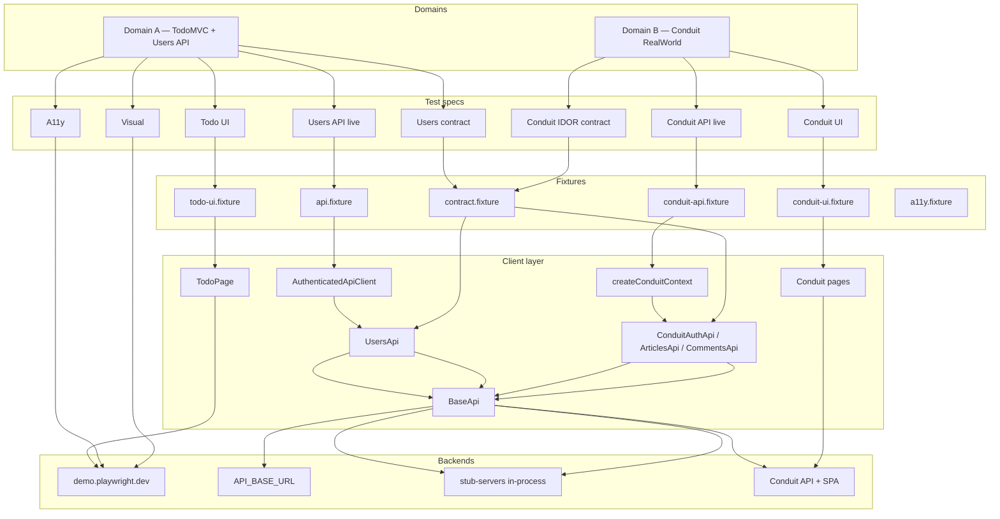
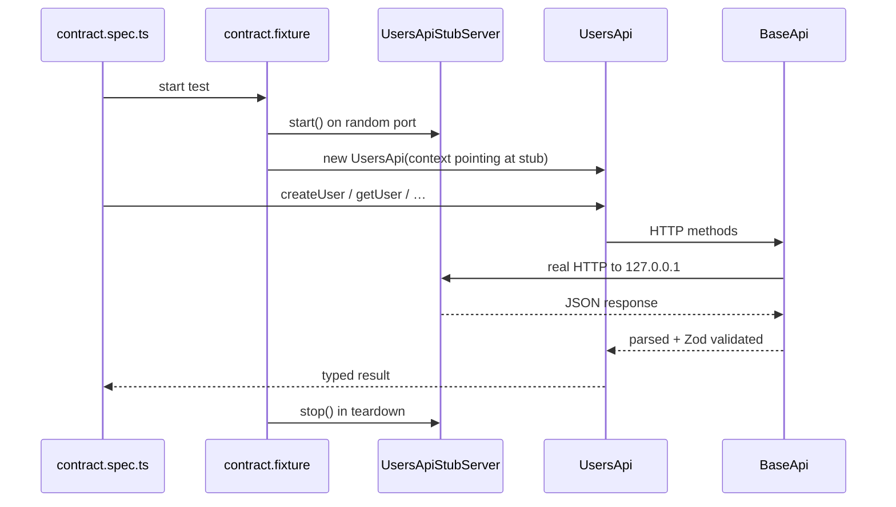

# Architecture

How test layers, fixtures, clients, and backends connect in this framework.

> **Navigation:** [`docs/INDEX.md`](./INDEX.md) · [`testing-layers.md`](./testing-layers.md) · [`conduit-map.md`](./conduit-map.md)

---

## High-level overview

The framework targets **two independent domains** on top of **shared
infrastructure** (Playwright config, fixtures pattern, factories, CI).

---

## Domain A — TodoMVC + Users API

Simple hosted demo + configurable REST API (ReqRes-style).

| Layer | Specs | Fixture | Client | Backend |
|---|---|---|---|---|
| Todo UI | `tests/ui/todo.spec.ts` | `todo-ui.fixture.ts` | `TodoPage` | `demo.playwright.dev` |
| Users API (live) | `tests/api/users.spec.ts` | `api.fixture.ts` | `UsersApi` + `AuthenticatedApiClient` | `API_BASE_URL` |
| Users API (contract) | `tests/contract/users.contract.spec.ts` | `contract.fixture.ts` | `UsersApi` | `UsersApiStubServer` |
| A11y | `tests/a11y/` | `a11y.fixture.ts` | axe-core | `demo.playwright.dev` |
| Visual | `tests/visual/` | — | screenshots | `demo.playwright.dev` |

**Auth (Domain A):**

- API: `AuthenticatedApiClient` adds `Bearer` token (fake JWT or real `/login`)
- Todo UI: optional `setup-auth-admin` project writes `storageState` to
  `.playwright/auth/admin.json` (TodoMVC specs do not require logged-in state)

---

## Domain B — Conduit (RealWorld)

Stateful full-stack app with JWT auth, slug uniqueness, and cross-layer flows.

See **[conduit-map.md](./conduit-map.md)** for the full file map and decision tree.

| Layer | Specs | Fixture | Backend |
|---|---|---|---|
| Live API | `tests/api/conduit/` | `conduit-api.fixture.ts` | Conduit API (demo or Docker) |
| UI | `tests/ui/conduit/` | `conduit-ui.fixture.ts` | Conduit SPA |
| IDOR contract | `tests/contract/conduit/` | `contract.fixture.ts` | `ConduitApiStubServer` |

**Auth (Domain B):**

- API: `Token <jwt>` via `createConduitContext(token)`
- UI: `authenticateConduitUser(page, user)` injects `localStorage.jwtToken`

---

## Shared infrastructure

These patterns apply to **both domains**:

| Concern | Location | Convention |
|---|---|---|
| HTTP abstraction | `api/core/baseApi.ts` | Maps non-2xx → `ApiError`; Zod parse on responses |
| Test data | `factories/` | Faker only in factories — never inline in `.spec.ts` |
| Page Objects | `tests/pages/` | All locators live in POM classes |
| Custom fixtures | `tests/fixtures/` | Specs import layer fixture, not raw `@playwright/test` |
| Env config | `config/env.ts` | Single source of truth for all env vars |
| Global hooks | `config/global-setup.ts`, `global-teardown.ts` | Fail-fast validation; clean auth artifacts |
| Playwright projects | `playwright.config.ts` | One project per layer/backend combination |
| CI | `.github/workflows/playwright.yml` | Split jobs: `ui-ci`, `api-ci`, `conduit-ci`, `visual-ci` |
| Tags | every spec | `@smoke`/`@regression` + layer tag; `@conduit`, `@security` for domain |

---

## Contract testing flow

The stub-server pattern keeps client code honest without a live backend:

Contract specs **must not** import `@fixtures/api.fixture` or depend on
`API_BASE_URL`. See [ADR 001](./adr/001-stub-servers-vs-contract-tests.md).

---

## Playwright project map

| Project | Spec glob | Parallel | Retries |
|---|---|---|---|
| `setup-auth-admin` | `tests/auth/admin.setup.ts` | — | — |
| `api` | `tests/api/*.spec.ts` | yes | 0 |
| `conduit-api` | `tests/api/conduit/**` | no | 2 |
| `contract` | `tests/contract/**` | yes | 0 |
| `ui-chromium/firefox/webkit` | `tests/ui/**` except `conduit/` | yes | 0 |
| `ui-visual` | `tests/visual/**` | yes | 0 |
| `ui-a11y` | `tests/a11y/**` | yes | 0 |
| `conduit-ui` | `tests/ui/conduit/**` | no | 2 |

Full matrix: [testing-layers.md](./testing-layers.md).

---

## Adding something new

| I want to… | Go to |
|---|---|
| Add a Todo UI test | [Cookbook: Todo UI](./cookbooks/add-todo-ui-test.md) |
| Add a Users API endpoint | [Cookbook: Users API](./cookbooks/add-users-api-endpoint.md) |
| Add a Conduit flow | [Cookbook: Conduit](./cookbooks/add-conduit-flow.md) |
| Understand Conduit file layout | [conduit-map.md](./conduit-map.md) |
