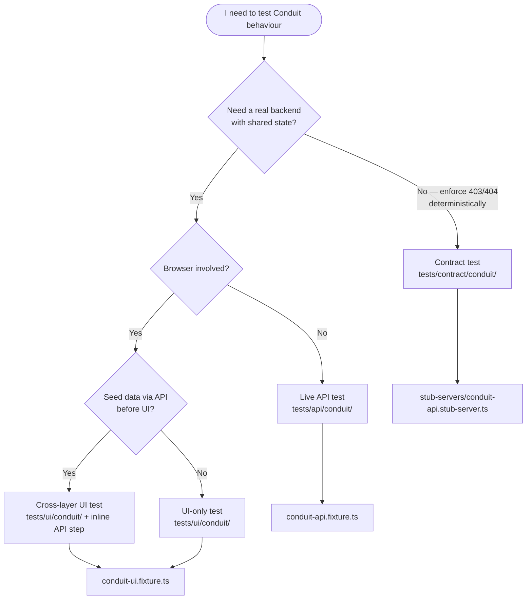

# Conduit map

Single reference for the RealWorld (Conduit) stack. Conduit code is spread
across eight areas — this page ties them together.

> **Navigation:** start at [`docs/INDEX.md`](./INDEX.md) if you are new to the repo.

---

## Decision tree — which layer do I need?



| Scenario | Layer | Spec folder | Playwright project |
|---|---|---|---|
| CRUD against real Conduit API | Live API | `tests/api/conduit/` | `conduit-api` |
| Browser flow (register, publish, read) | UI | `tests/ui/conduit/` | `conduit-ui` |
| API seed → UI assert (cross-layer) | UI + inline API | `tests/ui/conduit/` | `conduit-ui` |
| IDOR / security the public demo won't enforce | Contract | `tests/contract/conduit/` | `contract` |

---

## File map

| Concern | Path | Notes |
|---|---|---|
| **API client** | `api/conduit/` · `import { … } from '@api/conduit'` | `Token <jwt>` header (not `Bearer`) |
| **API services** | `api/conduit/services/` | `ConduitAuthApi`, `ArticlesApi`, `CommentsApi` |
| **Zod models** | `api/conduit/models/` | Request/response schemas |
| **Live API specs** | `tests/api/conduit/` | Uses `conduit-api.fixture.ts` |
| **UI specs** | `tests/ui/conduit/` | Uses `conduit-ui.fixture.ts` |
| **Page Objects** | `tests/pages/conduit/` · `import { … } from '@pages/conduit'` | 5 pages + `ConduitBasePage` |
| **Contract / IDOR** | `tests/contract/conduit/` | Uses `contract.fixture.ts` + stub |
| **Stub-server** | `stub-servers/conduit-api.stub-server.ts` | Enforces owner-only update/delete |
| **Test data** | `factories/conduit.factory.ts` | Unique titles (slug collision avoidance) |
| **UI auth helper** | `utils/auth/conduit.session.ts` | Injects `localStorage.jwtToken` |
| **Docker stack** | `docker-compose.conduit.yml` | Local API `:3000` + UI `:4201` |

---

## Fixtures

| Fixture file | Provides | Teardown |
|---|---|---|
| `tests/fixtures/conduit-api.fixture.ts` | `conduitUser`, `articlesApi`, `commentsApi`, `anon*` variants | Deletes all articles authored by `conduitUser` |
| `tests/fixtures/conduit-ui.fixture.ts` | `conduitHome`, `conduitLogin`, `conduitRegister`, `conduitEditor`, `conduitArticle` | Page objects only — no API cleanup |
| `tests/fixtures/contract.fixture.ts` | `conduitApiStub` | Stops in-process stub-server |

For live API tests prefer `conduit-api.fixture.ts` — it registers a throwaway
user and cleans up authored articles automatically.

For UI tests that need pre-seeded data, call the Conduit API inline inside a
`test.step` (see `tests/ui/conduit/articles.spec.ts`), then use
`authenticateConduitUser(page, user)` before navigation.

---

## Page Objects

| Class | Route | File |
|---|---|---|
| `ConduitHomePage` | `/` | `tests/pages/conduit/home.page.ts` |
| `ConduitLoginPage` | `/login` | `tests/pages/conduit/login.page.ts` |
| `ConduitRegisterPage` | `/register` | `tests/pages/conduit/register.page.ts` |
| `ConduitEditorPage` | `/editor` | `tests/pages/conduit/editor.page.ts` |
| `ConduitArticlePage` | `/article/{slug}` | `tests/pages/conduit/article.page.ts` |

All extend `ConduitBasePage` → `BasePage`.

---

## Auth differences (Conduit vs Users API)

| | Users API | Conduit |
|---|---|---|
| Header | `Bearer <token>` | `Token <jwt>` |
| Client | `AuthenticatedApiClient` | `createConduitContext(token?)` |
| Login path | `POST /login` via `utils/auth/login.ts` | `ConduitAuthApi.register()` / `.login()` |
| UI session | `storageState` (`.playwright/auth/admin.json`) | `localStorage.jwtToken` via `conduit.session.ts` |

The two stacks are intentionally separate — do not merge them.

---

## Run commands

```bash
# Live API (public demo by default)
npx playwright test --project=conduit-api

# UI (public demo UI by default)
npx playwright test --project=conduit-ui

# IDOR contract (no network)
npx playwright test tests/contract/conduit/

# Docker stack (recommended for CI-like runs)
npm run conduit:up
npm run test:conduit:smoke
npm run conduit:down

# By tag
npx playwright test --grep "@conduit"
npx playwright test --grep "@security"
```

Env vars: `CONDUIT_API_URL`, `CONDUIT_UI_URL` — see [README](../README.md#conduit-docker-stack).

---

## Reference specs

Copy patterns from these files:

| Pattern | File |
|---|---|
| Live API CRUD + cleanup fixture | `tests/api/conduit/articles.spec.ts` |
| UI register + publish | `tests/ui/conduit/articles.spec.ts` |
| Cross-layer API seed → UI assert | `tests/ui/conduit/articles.spec.ts` (first test) |
| Auth UI flow | `tests/ui/conduit/auth.spec.ts` |
| IDOR security contract | `tests/contract/conduit/articles-idor.contract.spec.ts` |

See also: [Cookbook — add a Conduit flow](./cookbooks/add-conduit-flow.md).
